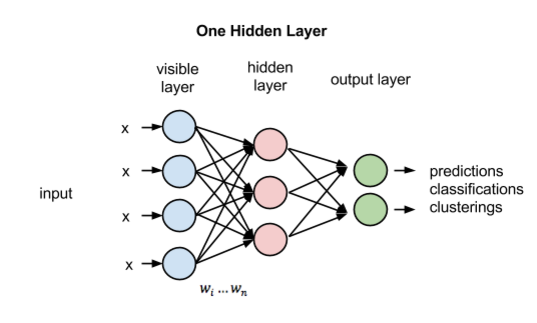
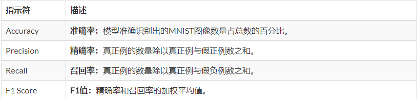

> ### Author: Jaiken Wong
> ### TODO : 持续更新AI学习 Demo(Python/Java)
> ### Recommend: 《PRML：模式识别与机器学习(中文版)》
---
- [x] 1.音乐分类器
    - 傅里叶变换
    - 逻辑回归
- [x] 2.手写字符识别
    -  单一/双隐藏层的神经网络
    
    - 结果评估
    
- [x] 3.图片分类
    - 动物图像分类
        - LeNet
        - AlexNet